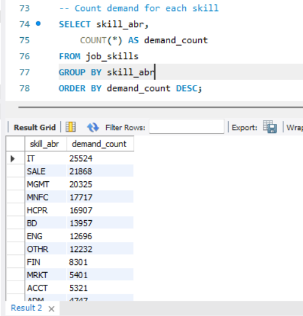
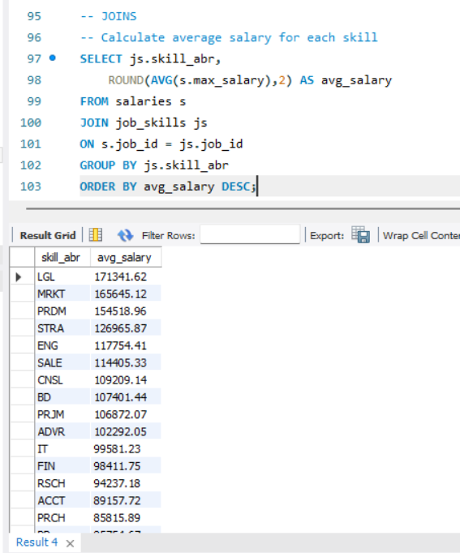
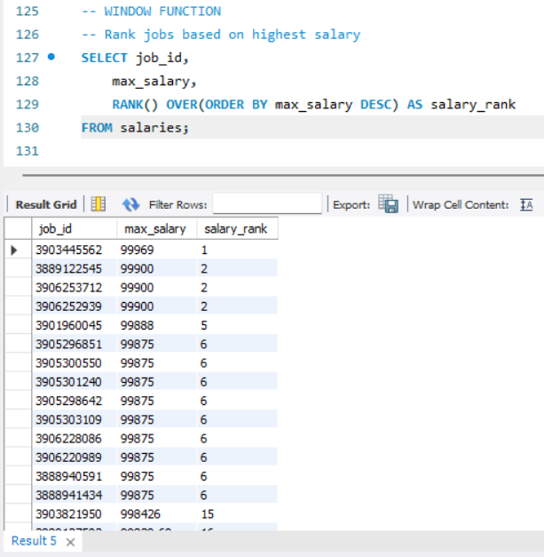
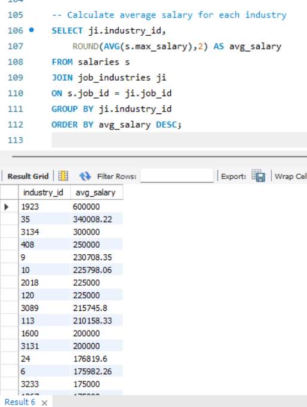

# 📊 Job Market Analysis using SQL

## 📌 Project Overview

This project analyzes job market data using SQL. The analysis focuses on salary trends, skill demand, and industry insights.

The project demonstrates:
- Data Cleaning
- Data Exploration
- Aggregate Functions
- JOIN Operations
- CASE Statements
- Window Functions

---

## 🛠️ Tools Used

- MySQL
- GitHub

---

## Business Questions Answered

- Which skills are most in demand?
- Which industries offer the highest salaries?
- What are the top-paying technical skills?
- How are salaries distributed across industries?
- Which jobs fall into high, medium, and low salary categories?

---

## 🗂️ Dataset Information

The dataset contains:
- Job salaries
- Job skills
- Industry information

### Tables Used

- salaries
- job_skills
- job_industries

---

## 📚 Key SQL Concepts Used

### 🔹 Data Cleaning
- NULL value checks
- Duplicate detection

### 🔹 Data Analysis
- Salary analysis
- Skill demand analysis
- Industry trends

### 🔹 Advanced SQL
- JOIN Operations
- CASE Statements
- Aggregate Functions
- Window Functions
- Ranking Functions

---

## 💻 Example SQL Queries

### Top Skills in Demand

```sql
SELECT skill_abr,
       COUNT(*) AS demand_count
FROM job_skills
GROUP BY skill_abr
ORDER BY demand_count DESC
LIMIT 10;
```

---

### Salary Ranking using Window Function

```sql
SELECT job_id,
       max_salary,
       RANK() OVER(ORDER BY max_salary DESC) AS salary_rank
FROM salaries;
```

---

## 📈 Key Insights

- Identified highest paying skills
- Found most demanded skills
- Compared salary trends across industries
- Categorized salaries into High, Medium, and Low

---

## 📁 Project Files

```plaintext
job-market-analysis/
│
├── README.md
├── job_market_analysis_project.sql
├── top_skills.png
├── salary_by_skill.png
├── window_function.png
└── industry_salary.png
```

---

# 📸 Project Screenshots

## Top Skills Analysis



---

## Salary by Skill Analysis



---

## Window Function Ranking



---

## Industry Salary Analysis



---

## 🚀 Future Improvements

- Add Power BI dashboard
- Add advanced SQL queries using CTEs
- Perform trend analysis
- Add data visualization

---

## 👩‍💻 Author

Karuna Rajput

GitHub:
https://github.com/karunarajput08

---

# ⭐ If you found this project useful, feel free to star the repository.
